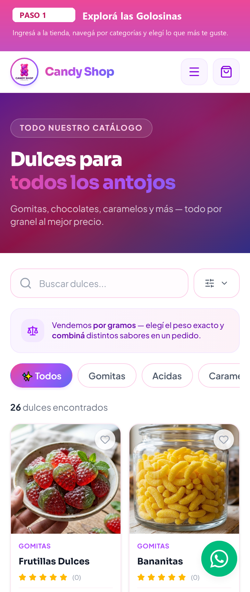
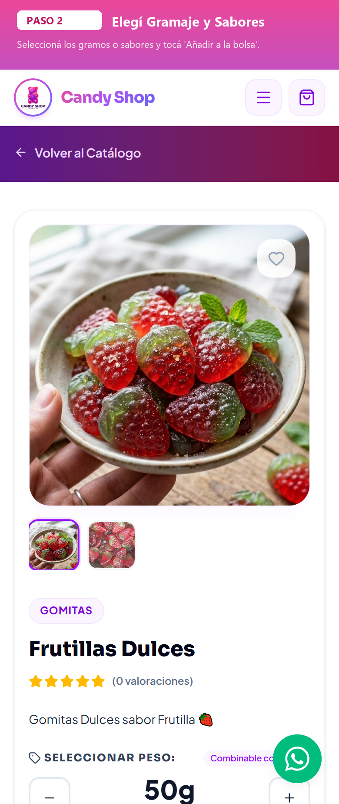
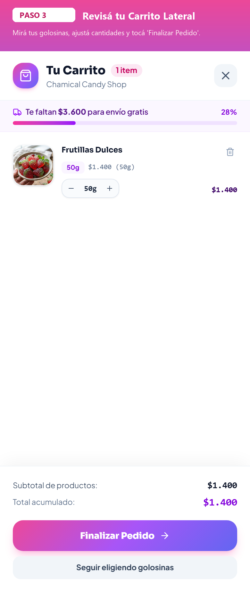
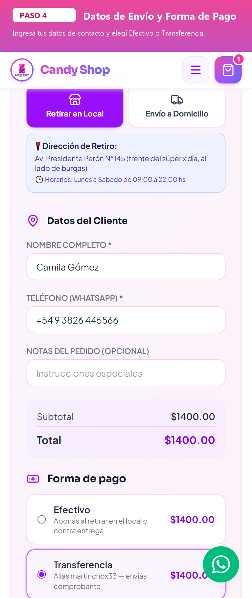
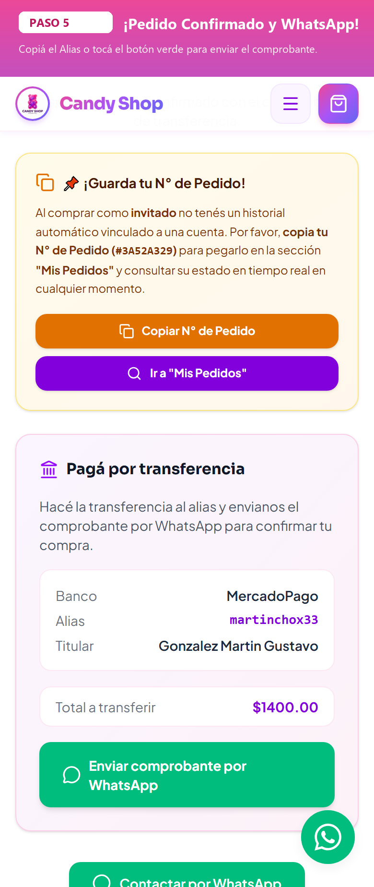

# 📱 Guía Paso a Paso: Cómo Comprar desde tu Celular en Candy Shop Chamical

¡Comprar tus golosinas favoritas desde tu celular es súper fácil y rápido! Seguí estos 5 simples pasos:

---

### 🛍️ Paso 1: Explorá nuestro catálogo desde tu celular
Ingresá a [Candy Shop Chamical](https://candyshopchamical.netlify.app/) desde el navegador de tu celular (Chrome, Safari, etc.). Podés navegar por categorías de gomitas por peso, combos, bandejas surtidas y chocolates.

---

### 🍬 Paso 2: Elegí tus productos y personalizá gramos o sabores
Tocá en **"Ver detalle"** sobre la golosina que más te guste:
- **Gomitas por peso:** Podés elegir 50g, 100g, 150g, 200g, etc.
- **Bandejas y combos:** Podés elegir los sabores de gomitas que más te gusten.
- Presioná **"Añadir a la bolsa"** para sumarlo a tu compra.

---

### 🛒 Paso 3: Revisá tu carrito en el menú lateral
Tocá el **botón flotante del carrito** en la esquina inferior derecha o el ícono de bolsa en la barra superior.
- Se deslizará un menú lateral desde la derecha donde verás todos tus productos y el **Total Acumulado**.
- Podés sumar o restar cantidades con los botones `+` y `-`.
- Presioná el botón **"Finalizar Pedido 🚀"**.

---

### 📝 Paso 4: Completá tus datos de entrega y medio de pago
En la pantalla de compra:
1. Seleccioná si querés **Retiro en el local** o **Envío a domicilio**.
2. Ingresá tu **Nombre y Apellido** y tu número de **WhatsApp / Celular**.
3. Elegí tu medio de pago: **Efectivo** al recibir o **Transferencia bancaria** (con alias directo).
4. Tocá en **"Confirmar pedido"**.

---

### 📲 Paso 5: ¡Pedido Confirmado y Envío por WhatsApp!
¡Listo! Tu pedido quedó registrado:
- Vas a ver tu **Número de Pedido** oficial (ej: `#3A89F12B`).
- Si pagás por transferencia, tenés a mano el **Alias** y datos de la cuenta.
- Presioná el botón **"Enviar comprobante por WhatsApp 💬"** para mandarnos el comprobante y coordinar la entrega en minutos.

---

🍬 **¡Listo! Disfrutá de las golosinas más ricas de Chamical!**
